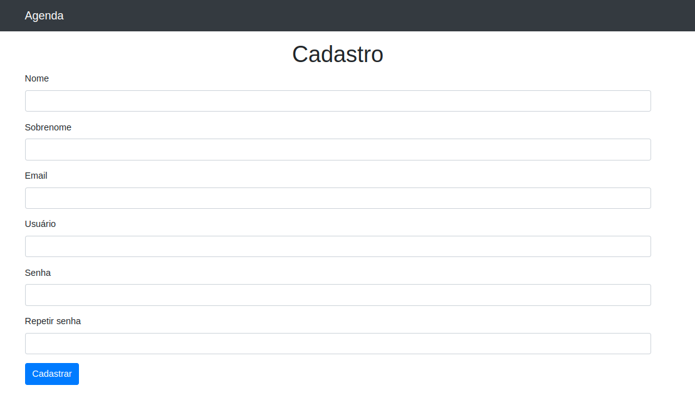
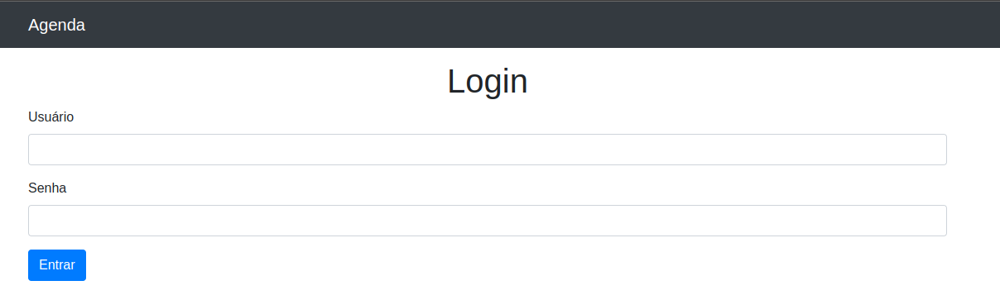
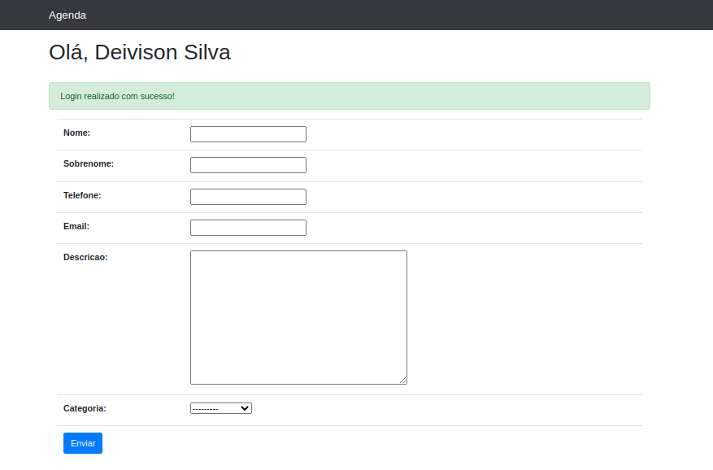
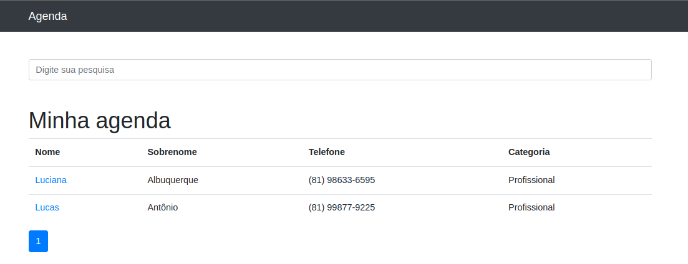
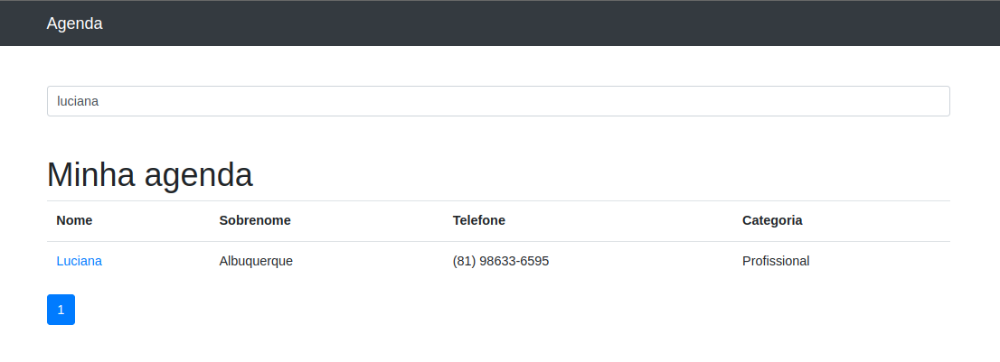
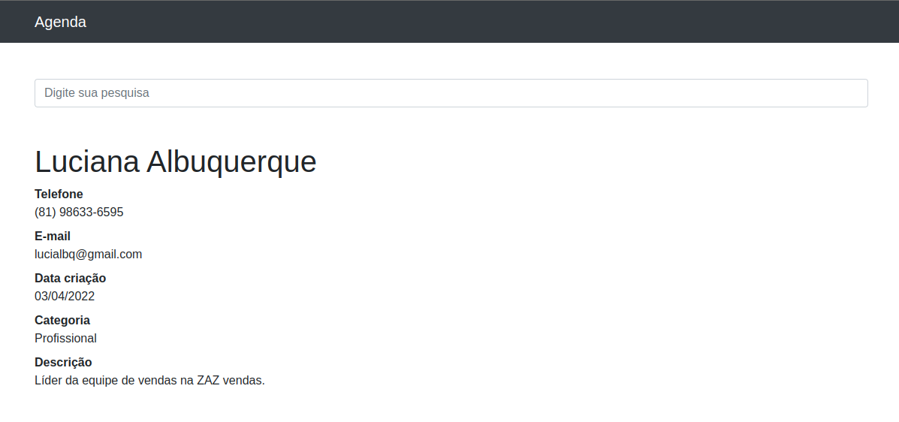

# Agenda

********** **Projeto ainda em fase de desenvolvimento** **********

Aplicação simples com foco no aprendizado do python e django, simulando as operações de uma agenda.

## Projeto Heroku

[Simple-Agenda](https://simple-agenda.herokuapp.com/)

## Endpoints

- https://simple-agenda.herokuapp.com/ -> Todos os contatos
- https://simple-agenda.herokuapp.com/1 -> Detalhes contato 1
- https://simple-agenda.herokuapp.com/accounts/register -> Cadastrar usuário
- https://simple-agenda.herokuapp.com/accounts/login -> Logar usuário
- https://simple-agenda.herokuapp.com//accounts/dashboard -> Cria novo contato (Acessada apenas com usuário logado)

## Funcionalidades

Inicialmente as funções são:

- Cadastro de usuário
- Login de usuário
- Criação de novos contatos
- Listagem de Contatos
- Pesquisa de algum contato

## Visualização

<h3>Cadastro</h3>

<h3>Login</h3>

<h3>Criar novo Contato</h3>

<h3>Todos os Contatos</h3>

<h3>Pesquisa</h3>

<h3>Detalhes</h3>

## Para Fazer

- Atualizar contato
- Remover contato
- Personalizar navbar e melhorar o fluxo da aplicação
